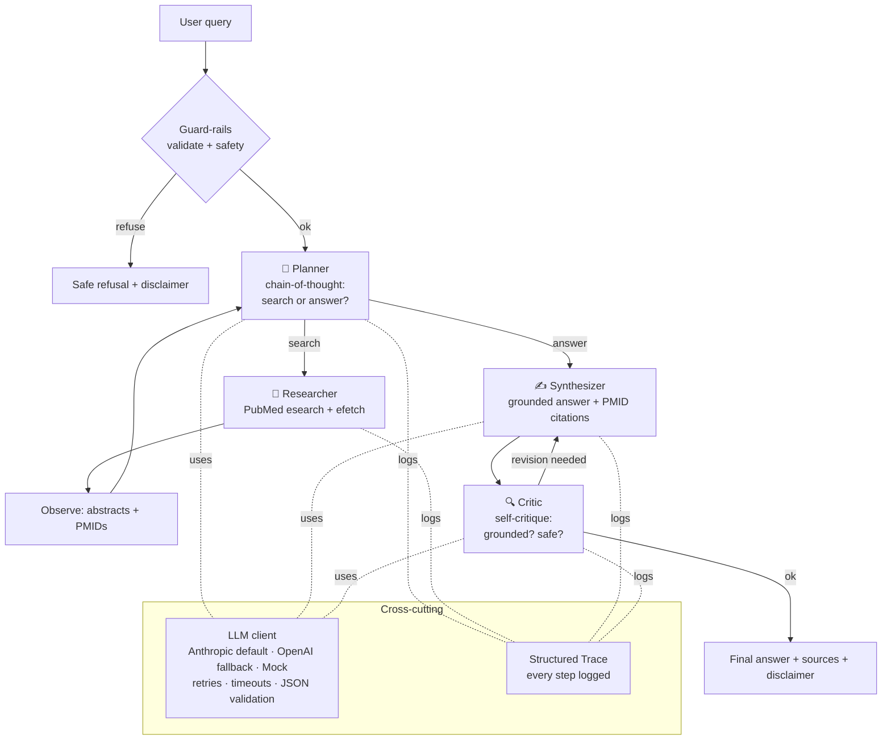

# Healthcare Q&A Agent 🏥

An **agentic AI application** that answers clinical/biomedical questions by
retrieving peer-reviewed evidence from **PubMed**, synthesizing a grounded
answer with inline citations, and self-critiquing that answer for hallucinations
and safety before returning it.

Built for the *GenAI & Agentic AI* assessment. It demonstrates a full agent loop
(**reason → plan → act → observe → respond**), real tool use, structured output
parsing, multi-agent orchestration, robust error handling, and a lightweight
evaluation harness.

---

## 1. Domain & design rationale

**Domain: Healthcare Q&A over PubMed.**

Why this domain:

- It maps directly to a **real, free, keyless API** (NCBI E-utilities), so the
  project is fully reproducible without paid data access.
- It forces the hard, interesting parts of GenAI engineering: **grounding**
  answers in retrieved evidence (RAG), **citing sources**, and **refusing**
  unsafe individualized medical advice — exactly the failure modes (hallucination,
  unsafe advice, over-claiming) the assessment asks us to handle.
- It is aligned with a healthcare revenue-cycle context, where trustworthy,
  source-attributed information matters more than fluent-but-unverifiable prose.

**Core design principles**

| Principle | How it shows up |
|---|---|
| Ground everything | The synthesizer may only use retrieved abstracts and must cite `[PMID]` markers; the critic rejects any `[PMID]` we didn't retrieve. |
| Fail safe, never crash | Provider fallback, retries with backoff, tool-level graceful degradation, and a fallback answer if the model is unreachable. |
| Make reasoning inspectable | Every step (thought, tool call, observation, critique) is recorded in a structured `Trace`. |
| Nothing hard-coded | Provider, model, temperature, timeouts, and keys all come from env/config. |
| Runnable with zero keys | A deterministic `mock` provider drives the entire loop offline for tests/CI/graders. |

---

## 2. Architecture

A **planner** decides whether more evidence is needed; a **researcher** runs the
PubMed tool; a **synthesizer** writes a grounded answer; a **critic** performs a
self-reflection pass and can trigger one revision. This is the *multi-agent
orchestration* bonus.



### The agent loop (`reason → plan → act → observe → respond`)

1. **Reason/Plan** — the planner emits a `PlannerDecision` (chain-of-thought +
   `search`/`answer`). On the first turn it must search.
2. **Act** — the researcher calls the `pubmed_search` tool with focused queries.
3. **Observe** — retrieved abstracts + PMIDs are added to the evidence set and
   fed back to the planner.
4. **Respond** — once evidence is sufficient (or the step budget is hit), the
   synthesizer writes the answer and the critic validates it.

### Repository layout (modular by concern)

```
healthcare-agent/
├── src/
│   ├── agent.py          # CLI entrypoint (reason→plan→act→observe→respond)
│   ├── orchestrator.py   # multi-agent loop: planner/researcher/synthesizer/critic
│   ├── evaluate.py       # evaluation harness
│   ├── config.py         # externalized settings (pydantic-settings)
│   ├── schemas.py        # Pydantic contracts for structured output
│   ├── prompts.py        # system prompts + few-shot (separated from logic)
│   ├── guardrails.py     # input validation + safety refusal + token budget
│   ├── logging_config.py # console logging + structured Trace
│   ├── llm/
│   │   └── client.py     # provider abstraction: Anthropic/OpenAI/Mock + retries
│   └── tools/
│       ├── base.py       # Tool + ToolRegistry
│       └── pubmed.py     # PubMed E-utilities tool (esearch + efetch)
├── tests/
│   ├── scenarios.json    # evaluation scenarios
│   └── test_unit.py      # offline unit tests (guardrails, parser, mock loop)
├── docs/
│   └── AGENT_RUN_REPORT.md
├── requirements.txt
├── .env.example
└── README.md
```

---

## 3. GenAI techniques demonstrated

- **Agentic loop with real tool use** — PubMed `esearch`/`efetch` function calls.
- **Structured output parsing** — every LLM turn is validated against a Pydantic
  schema (`PlannerDecision`, `DraftAnswer`, `Critique`); malformed JSON triggers a
  one-shot **self-repair** re-prompt.
- **RAG** — answers are grounded strictly in retrieved abstracts with `[PMID]`
  citations.
- **Chain-of-thought** — the planner reasons step-by-step before acting.
- **Self-reflection / self-critique** — the critic checks grounding + safety and
  can trigger a revision (advanced technique #2).
- **Multi-agent orchestration** — planner → researcher → synthesizer → critic
  (bonus).

## 4. Robustness & error handling

- **LLM failures** — per-call **timeouts**, **exponential-backoff retries**
  (tenacity) on transient/5xx errors, and automatic **provider fallback**
  (Anthropic ⇄ OpenAI) when a second key is configured. If the model is
  unreachable, the agent returns a graceful fallback message instead of crashing.
- **Tool failures** — network/XML errors are caught and returned as a structured
  `ToolResult(ok=False, …)` the agent can reason about; a verbose query that
  returns 0 hits is automatically retried with a keyword-simplified query.
- **Guard-rails** — input validation, token-budget estimation, and a lexical
  safety filter that **refuses individualized dosing/diagnosis** *before* any API
  call, complemented by the model-side safety prompt and the critic.
- **Observability** — a structured `Trace` records every step; `--show-trace`
  prints the full reasoning chain.

---

## 5. Setup

Requires **Python 3.10+**.

```bash
pip install -r requirements.txt
cp .env.example .env      # then add your API key (see below)
```

### Configuration (`.env`)

The agent runs with **one** provider key. Anthropic is the default; OpenAI is a
drop-in fallback. You can also run with **no key at all** using the `mock`
provider.

```ini
LLM_PROVIDER=anthropic            # anthropic | openai | mock
ANTHROPIC_API_KEY=sk-ant-...
ANTHROPIC_MODEL=claude-opus-4-8
# OPENAI_API_KEY=sk-...           # optional fallback
```

> PubMed needs **no key**. Setting `NCBI_EMAIL`/`NCBI_TOOL` (and optionally
> `NCBI_API_KEY`) just raises your rate limit.

---

## 6. Run it

```bash
# Ask a question (uses provider from .env)
python src/agent.py --domain healthcare --query "What are the latest treatment options for Type 2 diabetes?"

# Show the full reasoning trace
python src/agent.py --query "Do statins help in primary prevention?" --show-trace

# Machine-readable output
python src/agent.py --query "..." --json

# No API key? Run the entire loop offline with the deterministic mock provider:
python src/agent.py --query "What are the latest treatment options for Type 2 diabetes?" --provider mock
```

## 7. Evaluation

```bash
# Full evaluation across all scenarios (uses provider from .env)
python src/evaluate.py --scenarios tests/scenarios.json

# Offline (structural checks only — no keyword coverage without a real model):
python src/evaluate.py --scenarios tests/scenarios.json --provider mock

# Deterministic unit tests (guard-rails, PubMed parser, full mock loop)
pytest -q
```

The harness scores each scenario on objective, inspectable checks — *answered vs
refused*, **grounding (no hallucinated PMIDs)**, citations present, keyword
coverage (soft), and safety disclaimer — and prints an aggregate pass rate.
Exit code is non-zero if any scenario fails (CI-friendly).

See **[`docs/AGENT_RUN_REPORT.md`](docs/AGENT_RUN_REPORT.md)** for a full sample
trace, evaluation results, and design trade-offs.

---

## 8. Notes, limitations & trade-offs

- **Not a medical device.** Output is educational, source-attributed information,
  not medical advice; the agent refuses individualized clinical decisions.
- **Retrieval quality** depends on PubMed relevance ranking and the planner's
  query craft. The `mock` provider passes the raw question through (hence the
  keyword-simplification fallback in the tool).
- **Keyword-coverage** in evaluation is intentionally a *soft* signal — it flags
  off-topic answers without penalizing valid paraphrases. Grounding and safety
  are the hard gates.
